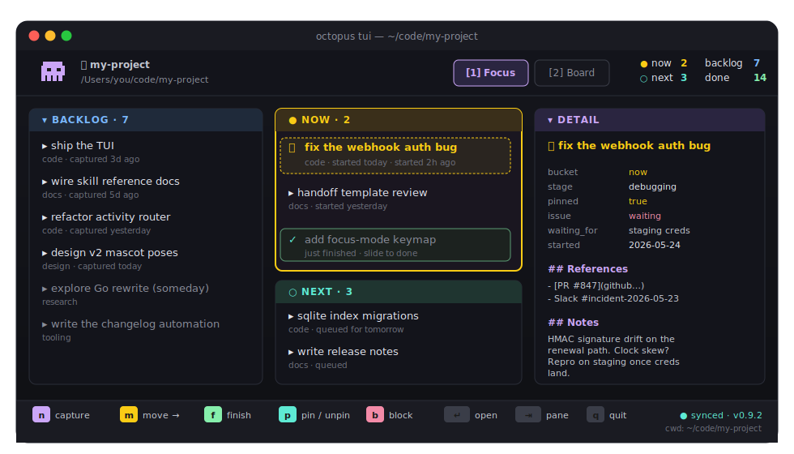
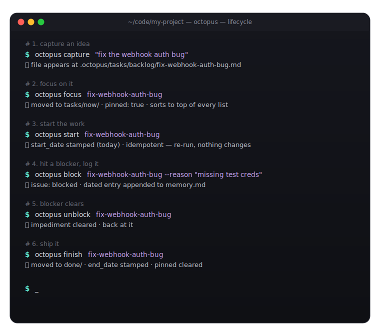

<div align="center">


# Octopus

**A folder-first task system. CLI + skill.**

*Tentacles fan out into every folder you care about. Each project gets its own task structure — captured, organized, alive — right where the work belongs.*

*Octopus reaches into each folder, understands what it is, smartly organizes the tasks inside it — and also acts as the central system that ties them all together. One brain, eight arms. Backed by a CLI and a Claude Code skill.*


</div>

<div align="center">



</div>

---

## The pitch

You have folders. Lots of folders. A code repo here. A side project there. A vault of notes. A client gig. Each one is a *thing you're doing*.

Most task apps make you describe those things twice — once as folders on disk, once as records in some app's database. Then they drift apart and you spend Sunday afternoon reconciling them.

Octopus skips the middleman.

```
cd ~/code/my-project
octopus init
octopus capture "fix the webhook auth bug" --now
```

That's it. The folder is now a tracked **activity**. Tasks live inside it as plain markdown files. State travels with the folder. Move it, rename it, sync it through Dropbox — the activity moves too.

Open the same folder in Obsidian? Open it in the terminal? `octopus where`. Hand it to Claude Code? The agent reads the same files. **Every viewer is just a lens on the same disk truth.**

---

## The mental model

<div align="center">


</div>

**Octopus → activity → task.**
That's the whole shape.

- **Octopus** is the omnipresent entity. Invoke it from the terminal, or hand it to any agent.
- An **activity** is a position — a folder containing `.octopus/activity.md`. Self-describing, portable, git-trackable.
- **Tasks** are the items inside an activity. Plain markdown files under `.octopus/tasks/`.

How commands flow follows the hierarchy:

**GLOBAL CONTEXT** (cwd ~/user)
```
  octopus list               → activities (the default at global scope)
  octopus list activities    → explicit form
  octopus list tasks         → cross-activity tasks (rare; use filters)
  octopus dashboard          → composite view across all activities
  octopus add task "X" --activity <id>   → reach into an activity by name
```

**INSIDE AN ACTIVITY** (cwd has .octopus/)
```
  octopus list               → tasks (the default at activity scope)
  octopus list tasks         → explicit form
  octopus list activities    → still works — shows all activities
  octopus capture "X"        → adds a task here
  octopus where              → "you are in <activity>"
```

> [!TIP]
> **`list` is context-aware** (defaults to whichever level you're at). **`list tasks` and `list activities` are explicit overrides** when you want the other axis.

If a folder you're in contains sub-folders with their own `.octopus/`, the inner ones are *visible to the index* but `list tasks` from the outer activity does not recurse into them — they're separate activities. You'd see them via `list activities`.

---

## Why this exists

We tried the alternatives. Each one solved one slice and broke three others:

| | Captures fast | Holds context | Lives with the work | Lives in git | Hands off to agents |
|---|:-:|:-:|:-:|:-:|:-:|
| Apple Reminders | ✅ | ❌ | ❌ | ❌ | ❌ |
| Obsidian | ⚠️ | ✅ | ⚠️ | ⚠️ | ⚠️ |
| Random `TODO.md` | ✅ | ⚠️ | ✅ | ✅ | ⚠️ |
| SaaS task apps | ✅ | ✅ | ❌ | ❌ | ⚠️ |
| **Octopus** | ✅ | ✅ | ✅ | ✅ | ✅ |

Octopus closes the gap between where work lives and where it's tracked.

---

## What an `.octopus/` folder looks like

Every tracked folder gets a hidden `.octopus/` directory. That's where the brain lives.

<div align="center">


</div>

Everything optional except `activity.md`. The CLI creates folders lazily as you use them.

---

## Five buckets — that's the whole pipeline

Octopus has one big idea about workflow: **five piles**, and tasks move between them. No fancy kanban columns. No custom states. Just five buckets that match how humans actually think.

<div align="center">


</div>

The verbs that move tasks between buckets:

| You say | Bucket goes to | What it means |
|---|---|---|
| `octopus capture "..."` | → backlog | "Catch this idea before I forget." |
| `octopus plan <slug>` | → next | "I'm committing to this." |
| `octopus focus <slug>` | → now | "This is for right now." Also pins it. |
| `octopus defer <slug>` | now → next | "Not today after all." |
| `octopus park <slug>` | any → backlog | "Let it cool. I'm not ready." |
| `octopus finish <slug>` | → done | "🎉" |
| `octopus drop <slug>` | → dropped | "Nope. Moving on." |
| `octopus start <slug>` | (resumes from done/dropped) | Idempotent. Just stamps `start_date`. |

That's the whole pipeline. Eight verbs, five buckets.

---

## A task's life, end to end

<div align="center">



</div>

The file at `.octopus/tasks/done/fix-webhook-auth-bug.md` ends up looking like this:

```yaml
---
title: Fix the webhook auth bug
created: 2026-05-22
bucket: done
start_date: 2026-05-22
end_date: 2026-05-23
---

## References
```

Three lines added beyond the capture defaults. Everything else is omitted because **defaults don't get written**. The file stays small. Hand-edit it whenever — Octopus rolls with it.

---

## Axes — how a task knows where it stands

Tasks have several independent ways of being "in motion." Each one answers a different question. None of them overlap.

<div align="center">


</div>

The trick is that they're all *independent*. A task can be `bucket: backlog` (haven't committed) AND `pinned: true` (nagging at me) AND `issue: waiting` (need someone else's input) AND `run_state: queued` (an agent will pick it up tonight) — all at once. Each axis carries information no other axis can.

> [!TIP]
> **Default-omission**: if a field is at its default, Octopus doesn't write it. So a normal-priority human task captured with no fuss has *three lines* of frontmatter: `title`, `created`, `bucket`. The file stays small. The signal stays loud.

---

## The verb cheat sheet

Octopus thinks in verbs, not field edits. The full list, organized by what they do:

### Capture
```
octopus capture "..."           # → backlog
octopus capture "..." --next    # → next
octopus capture "..." --now     # → now, pinned
```

### Move through the pipeline
```
octopus plan <slug>             # → next
octopus focus <slug>            # → now, pinned
octopus defer <slug>            # now → next
octopus park <slug>             # any → backlog, unpinned
```

### Lifecycle
```
octopus start <slug>            # stamp start_date (idempotent)
octopus finish <slug>           # → done, stamp end_date
octopus drop <slug>             # → dropped
```

### When something's stuck
```
octopus block <slug> --reason "..."
octopus wait  <slug> --for "..."
octopus unblock <slug>
```

### Attention
```
octopus pin <slug>              # surface to top of every list
octopus unpin <slug>
```

### Visibility
```
octopus archive <slug>          # hide from default views
octopus restore <slug>
```

### Look around
```
octopus where                   # what's the current activity?
octopus list                    # what's on my plate? (context-aware)
octopus list --all              # everything, everywhere
octopus loops                   # all open loops (unfinished)
octopus status <slug>           # detailed view, one activity
octopus task show <slug>        # the raw file
```

### Manage the index
```
octopus reindex                 # rebuild the SQLite index from disk
octopus config root add <path>  # tell Octopus where to look
octopus config root list
```

### Escape hatch
```
octopus set <slug> --priority urgent --due 2026-06-01 --stage editing
```

Type `octo` instead of `octopus` if you're in a hurry. Same thing.

---

## Installation

Octopus ships as a Python package. Requires Python **3.11+**.

### pipx (recommended)

```bash
pipx install octopus-cli
octopus --version
```

> Until octopus-cli lands on PyPI, install from a built wheel:
>
> ```bash
> git clone https://github.com/alexsmedile/octopus
> cd octopus/cli
> python -m build              # produces dist/octopus_cli-X.Y.Z-py3-none-any.whl
> pipx install ./dist/octopus_cli-*.whl
> ```

### From source (editable)

For development:

```bash
git clone https://github.com/alexsmedile/octopus
cd octopus/cli
pip install -e ".[dev]"
```

### Upgrade / uninstall

```bash
pipx upgrade octopus-cli      # or: pipx install --force ./dist/*.whl
pipx uninstall octopus-cli
```

### Sanity check

```bash
octopus --version             # → octopus X.Y.Z
octopus diagnose --no-zip     # prints version, config, index stats — for bug reports
```

`octopus diagnose` bundles a redacted report (paths under `$HOME` are rewritten to `~/`) into a zip you can attach to GitHub issues.

---

## How an `.octopus/` folder is born

```bash
cd ~/code/my-project
octopus init --type code --area work
# ✓ Initialized activity my-project at /Users/you/code/my-project
#   storage mode: folders (backlog, done, dropped, next, now)
```

Now drop in a few tasks:

```bash
octopus capture "Fix the webhook auth bug" --next --priority urgent
octopus capture "Write release notes" --next
octopus capture "Refactor the auth middleware"
octopus focus fix-the-webhook-auth-bug
```

Where you are now:

```bash
$ octopus where

  Activity  my-project
  Title     My Project
  Path      /Users/you/code/my-project
  Type      code
  Status    active
  Area      work
  Storage   folders

  now      1
  next     1
  backlog  1

  Pinned:
    fix-the-webhook-auth-bug  Fix the webhook auth bug
```

Open `~/code/my-project` in any editor. The `.octopus/` folder is right there. Open `~/code/my-project/.octopus/tasks/now/fix-the-webhook-auth-bug.md` and you'll find clean YAML frontmatter + an empty body waiting for notes. Edit it. Octopus will roll with whatever you do.

---

## Where things live in this repo

Four top-level folders that matter: **`cli/`** (the Python CLI), **`skills/octopus/`** (the standalone Claude Code skill), **`plugin/`** (Claude Code + Codex plugin), and **`.spectacular/`** (design specs and decisions). Full tree, conventions, and a "where to look for what" table in **[`docs/REPO-LAYOUT.md`](docs/REPO-LAYOUT.md)**.

---

## Daily driver — the TUI

`octopus tui` opens a Textual TUI scoped to the current activity. Two modes: **Focus** (`1`) — Backlog · Now · Next · Detail panes for the act loop — and **Board** (`2`) — four-column kanban `backlog → next → now → done`. The mascot in the header is animated and reacts when you finish (`f`) or pin (`p`) a task. All mutations route through the same `octopus.actions` write layer the CLI uses, so there's no second source of truth.

<div align="center">


</div>

Full keymap, modes, mascot behavior, and scope rules in **[`docs/TUI.md`](docs/TUI.md)**.

---

## Status & what's next

Latest: **v0.9.2** (2026-05-24) — animated TUI mascot, 601 tests passing. Currently on phase **06 — adapter framework** (the path to v1). v1 ships when 06 + 07 (Obsidian bridge) are done.

Full release history, phase table, and what's queued in **[`docs/ROADMAP.md`](docs/ROADMAP.md)**. Per-release detail in [CHANGELOG.md](CHANGELOG.md).

---

## Honest positioning

### Octopus is for you if

- You live on the command line and run many projects at once.
- You want your tasks to **live next to your work**, not in a SaaS.
- You use Obsidian (or want to) and like plain-text-everything.
- You work with AI coding agents and want them to know where they are.
- You're allergic to losing your data in someone else's database.

### Octopus is *not* for you if

- You want a polished GUI app with native widgets. (We have a terminal TUI on the roadmap. It's a TUI.)
- You want team collaboration with permissions and comments. (Octopus is single-user. Git is your sync layer.)
- You need cloud sync built in. (No. Git, Syncthing, iCloud, Dropbox — pick one.)
- You want recurring tasks today. (Reserved for v2.)

---

## Credits & license

Built by Alessandro Smedile, 2026.

License: MIT. See [LICENSE](LICENSE) when v1 ships.

The mascot is a friendly orange octopus 🐙 because tasks have eight little arms reaching into every folder, and someone has to keep them straight.

---

## A note for the curious

The folder *is* the activity. The protocol — not the implementation — is the product. The CLI is Python today; nothing stops a Go or Rust rewrite tomorrow. As long as the `.octopus/` contract holds, every tool that speaks it is "Octopus".

---

<div align="center">

*The folder is the activity. The protocol is the product.*

</div>
