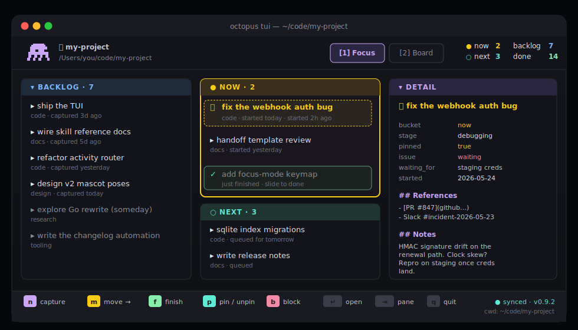

# The TUI

`octopus tui` opens a Textual-based terminal UI scoped to the **current activity** (CWD walk-up to the nearest `.octopus/`). Two modes share one keymap.

## Modes

| Mode | Trigger | Layout |
|---|---|---|
| **Focus** | `1` (default) | Backlog · Now (pinned, active) · Next · Detail |
| **Board** | `2` | Four-column kanban: `backlog → next → now → done` |

The mascot lives in the header. It's a 16×14 pixel-art octopus rendered with `rich-pixels`; it blinks on a calm idle loop, does a "capovolta" flip on `f` (finish), and a Michael-Jackson moonwalk on `p` (pin/unpin). The animation system is documented in [`.spectacular/requests/31-tui-mascot-ascii-animations/PLAN.md`](../.spectacular/requests/31-tui-mascot-ascii-animations/PLAN.md).

## Keymap

### Movement
| Key | What |
|---|---|
| `1` / `2` | Focus / Board mode |
| `←` `→` | move between quadrants / columns |
| `↑` `↓` | move within a list (edges jump panes) |
| `Tab` / `S-Tab` | cycle panes |
| `Enter` | open task detail overlay |

### Mutations (route through `octopus.actions`)
| Key | What |
|---|---|
| `n` | capture new task into the focused pane |
| `m` | advance one step along the pipeline (`backlog → next → now → done`) |
| `M` | move to a chosen bucket (prompts) |
| `f` | finish task — moves to `done/`, stamps `end_date`, clears `pinned` |
| `d` | drop (with `y/n` confirm) |
| `p` | toggle pin |
| `e` | open the task file in `$EDITOR` |
| `s` / `S` | start session (quick / with title) |
| `b` | block (prompts for reason) |
| `u` | unblock |

### Search & maintenance
| Key | What |
|---|---|
| `/` | filter by title substring |
| `r` | refresh from index (clears filter) |
| `?` | help overlay (full keymap) |
| `q` | quit (confirms if a session is open) |

## The write layer

All mutations route through `octopus.actions` — the same write layer the CLI uses. There is **no second source of truth**: typing `n` in the TUI executes the same code path as `octopus capture` on the command line. The SQLite index, the files on disk, and the TUI view never disagree.

## Scope rules

- Without `-a/--activity`, the TUI walks up from CWD to find the nearest `.octopus/` and locks onto that activity.
- With `-a <id-or-path>`, it pins to that activity regardless of CWD.
- Outside any `.octopus/` and without `-a`, the TUI refuses to launch and points you to `octopus dashboard` instead.

## Logs

The TUI writes a session log to `~/.local/state/octopus/tui-<date>.log` (or the equivalent on macOS). Bug reports should include this file — `octopus diagnose` bundles it automatically.

## Related docs

- [Repo layout](REPO-LAYOUT.md) — where the TUI source lives in the repo
- [`.spectacular/specs/CLI-VERBS.md`](../.spectacular/specs/CLI-VERBS.md) — the CLI verbs the TUI delegates to
- [Roadmap](ROADMAP.md) — what's planned next for the TUI
